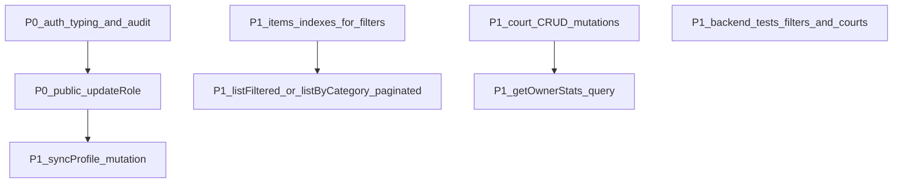

# Backend-only: what to build next

Scope: **[packages/backend/convex](packages/backend/convex)** only. No apps, no dashboards, no hooks. Optional footnote for [microservices/ai/app.py](microservices/ai/app.py) if you treat the FastAPI service as “backend” too.

## Current ground truth (from repo)

- **Items:** [items/queries.ts](packages/backend/convex/items/queries.ts) exposes `listAvailable`, `listMyItems`, `listAll`, `getById`. There is **no** category / price-range / `ai_label` filtering and **no** paginated marketplace list.
- **Schema:** `items` has [by_owner](packages/backend/convex/schema.ts) and [by_status_and_createdAt](packages/backend/convex/schema.ts); there is **no** index on `category` or `user_price` (blueprint Phase 2 and execution plan “GLOBAL BACKEND TASKS” still apply).
- **Courts:** Inserts exist only in [seed.ts](packages/backend/convex/seed.ts) and tests. There are **no** owner-scoped court CRUD mutations (execution plan Phase 2: “court management mutations for owners”).
- **Users:** [users.ts](packages/backend/convex/users.ts) only exposes **internal** `upsertUser`. There is **no** public `updateRole` or `syncProfile` mutation.
- **Auth typing debt:** [auth.ts](packages/backend/convex/auth.ts) still uses `ctx: any` and `userId as any` (execution plan validation item).
- **B2B analytics:** No `getOwnerStats` (or equivalent) query exists in Convex.

## Recommended order (Convex)

### P0 — finish hardening and RBAC API

1. **Tighten [auth.ts](packages/backend/convex/auth.ts)**
  Replace `any` with the proper Convex Auth callback context type and `Id<"users">` for `userId`, reusing patterns from Convex Auth docs / existing strict code.
2. **Pass a full `ctx.auth` audit**
  Execution plan critical path: ensure every **public** `mutation` / `action` that mutates data calls `getUserIdentity()` (or your chosen auth helper) and enforces ownership where required. Items/bookings/images are partly done; treat this as a checklist pass, not a rewrite.
3. **Public `users:updateRole` (or equivalent)**
  Plan marks this as **[P0] Backend**. Implement a **mutation** that:
  - Requires authenticated user.
  - Only allows a user to set their own role (or document if `ADMIN` can set others).
  - Validates `PLAYER | COURT_OWNER | ADMIN` with `v.union` / literals.
  - Can delegate to `upsertUserRecord` logic to avoid duplication.

### P1 — marketplace search (backend only)

1. **Add indexes on `items`** in [schema.ts](packages/backend/convex/schema.ts)
  Design for **index-first** queries (avoid `.filter()` on large sets per Convex rules). Typical pattern:
  - Equality filters you need together (e.g. `status` + `category`) plus sort field (`createdAt` or `user_price`) — name indexes per Convex convention (`by_status_and_category_and_createdAt`, etc.).
  - Price range often needs either a bounded strategy (e.g. bucketed prices) or accepting an index on `user_price` with `status` depending on query shape — pick one API contract and index accordingly.
2. **New query** in [items/queries.ts](packages/backend/convex/items/queries.ts)
  e.g. `listAvailableFiltered` with `paginationOptsValidator`, args for category (optional), min/max price (optional), `ai_label` (optional if indexed or post-filter is acceptable only for tiny sets — prefer index).

### P1 — courts and owner analytics

1. **Court management mutations** (new file e.g. `convex/courts/mutations.ts` or under `bookings/`)
  - `createCourt`: authenticated, `role === COURT_OWNER`, set `ownerId` from identity.
  - `updateCourt` / `deleteCourt`: enforce `court.ownerId === identity.subject`.
  - `deleteCourt` must define behavior if future bookings exist (reject vs cascade — recommend reject with clear error).
2. `**getOwnerStats` query** (new file e.g. `convex/owners/queries.ts`)
  Aggregate from `bookings` + `courts` for courts owned by the current user (counts by status, revenue sum for confirmed, date range args). Keep return shape explicit with `returns:` validators.

### P1 — profile sync

1. `**users:syncProfile` mutation**
  Patch allowed profile fields on the current user’s `users` doc (avatar storage id, bio, etc. — align with fields already in [schema users](packages/backend/convex/schema.ts): names, phone, location, etc.). Validate each field; reject unknown keys.

### P1 — tests (still backend-only)

1. Extend [packages/backend/convex/tests](packages/backend/convex/tests) (pattern in [bookings.test.ts](packages/backend/convex/tests/bookings.test.ts)) for:
  - Filtered / paginated items query correctness.
  - Court CRUD authorization.
  - Double-booking already covered — add cases only if gaps appear.

## Optional: Python service (only if “backend” includes AI)

If you include [microservices/ai](microservices/ai): execution plan lists **response validation (Zod or equivalent)**, **request logging**, and **mock-AI env toggle** — these are **not** in `packages/backend/convex` but unblock safer AI actions.

## Explicitly out of scope (per your request)

- Mobile image picker, “My Listings” UI, booking modals, TanStack Router, Recharts, hooks, badges in UI, role selection screens, push notifications, deep linking, and cross-platform smoke tests.

