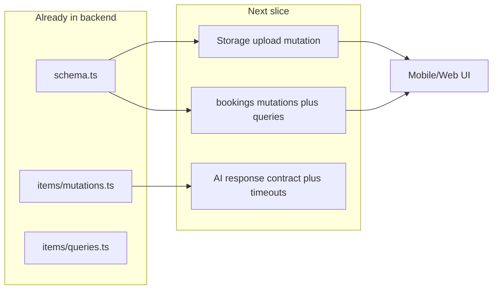

# TennisFinder: plan from EXECUTION_PLAN + SYSTEM_BLUEPRINT

## How the two docs fit together

- **[SYSTEM_BLUEPRINT.MD](.cursor/SYSTEM_BLUEPRINT.MD)** states the split: Convex is source of truth; Python FastAPI is inference; actions bridge via `fetch`. It marks **Image Storage Flow** as the remaining Phase 1 item and ties Phase 2 marketplace work to **indexes**, **Mark as Sold**, and **search/filtering**.
- **[EXECUTION_PLAN.MD](.cursor/EXECUTION_PLAN.MD)** is a full backlog with P0/P1/P2, critical path, and phased delivery. **Many checkboxes are stale** relative to the codebase (see below).

## Repo reality vs. unchecked plan items (important drift)

Already implemented in code (plan still shows `[ ]` for several of these):

| Area                                    | Plan says        | Actual in repo                                                                                                                                                                      |
| --------------------------------------- | ---------------- | ----------------------------------------------------------------------------------------------------------------------------------------------------------------------------------- |
| Schema: courts / bookings / storage IDs | P0 define tables | `[packages/backend/convex/schema.ts](packages/backend/convex/schema.ts)` — `courts`, `bookings`, `items.images` as `v.array(v.id("_storage"))`, composite index `by_court_and_time` |
| Items: update / delete / sold toggle    | P0 mutations     | `[packages/backend/convex/items/mutations.ts](packages/backend/convex/items/mutations.ts)` — `update`, `remove`, `toggleStatus` with `ownerId` vs `identity.subject` checks         |
| Items index by status + createdAt       | P0               | `by_status_and_createdAt` on `items`                                                                                                                                                |
| Users role field                        | P0               | `users.role`: `PLAYER`                                                                                                                                                              |

Still **missing or incomplete** vs. plan and blueprint:

- **Convex File Storage upload path**: no `generateUploadUrl` (or equivalent) under `convex/`; multi-image listing cannot be completed end-to-end until this exists.
- **Booking domain logic**: schema exists but **no** `bookings/` queries/mutations (no `createBooking`, overlap validation, `listAvailability`, `updateBookingStatus`).
- **AI contract**: `[microservices/ai/app.py](microservices/ai/app.py)` `/label` returns `"label"`; `[packages/backend/convex/items/marketplaceAI.ts](packages/backend/convex/items/marketplaceAI.ts)` reads `labelData.status` — labels will be wrong/empty when the response is otherwise OK. Plan’s “standardize ai_label strings” is not done.
- **Hardening**: no bounded timeout on AI `fetch` calls in `predictItemPrice` / `evaluateFairness`; `autoListWithAI` uses `args.images as any` because args are `v.array(v.string())` while `create` expects `Id<"_storage">[]`.
- **Planned indexes/queries**: no `items` index **by category and price**; no `items:listByCategory` with pagination.
- **Frontends**: `[apps/mobile/app/index.tsx](apps/mobile/app/index.tsx)` is a stub; web is minimal — marketplace/booking UX from the plan is largely not built.

## What to implement next (ordered, P0-first)

Aligned with **EXECUTION_PLAN** critical path and **SYSTEM_BLUEPRINT** Phase 1 (“Intelligent Infrastructure”): finish storage + fix AI wire-up, then booking engine.

1. **File storage ingestion (unblocks multi-image and removes `as any`)**
  - Add a small Convex module (e.g. `[packages/backend/convex/images.ts](packages/backend/convex/images.ts)` or `storage.ts`) with a **public mutation** `generateUploadUrl` using `ctx.storage.generateUploadUrl()` (and optional MIME allowlist for images per plan §4).  
  - Register in Convex’s file-based API; mobile/web will call this before `items.mutations.create` / `update`.  
  - Update `[packages/backend/convex/items/marketplaceAI.ts](packages/backend/convex/items/marketplaceAI.ts)`: change `autoListWithAI` `images` args to `v.array(v.id("_storage"))`, remove the `as any`, and keep graceful degradation when AI is down.
2. **Standardize AI label API (P0, quick fix)**
  - Either: FastAPI `/label` returns a field Convex already expects (e.g. add `status` mirroring `label`), **or** change Convex to read `label` (and map to stored `ai_label`).  
  - Optionally align **threshold** with plan (e.g. 15% in Python vs current 10%) in one place and document the canonical label strings (`fair` / `underpriced` / `overpriced` vs display casing).
3. **AI action hardening**
  - Add **~5s timeout** (and try/catch) around `fetch` in `predictItemPrice`, `evaluateFairness`, and the predict/label calls inside `autoListWithAI`; ensure listing still succeeds with `"AI Offline"` (already partially there in `autoListWithAI`).
4. **Booking engine (next backend vertical)**
  - New files under `packages/backend/convex/bookings/` (or split `queries.ts` / `mutations.ts`):  
    - `createBooking` with **atomic overlap check** for `Confirmed` (and optionally `Pending` per product rules) using `by_court_and_time` and time-range logic.  
    - `updateBookingStatus` for owner confirm/cancel (verify caller owns `court` via `court.ownerId`).  
    - `listAvailability` or `listByCourt` + date range (plan § Booking).
  - Add tests or manual test notes for double-booking (plan §6).
5. **Defer until after the above (unless you reprioritize)**
  - `items` index by category + price and `listByCategory` pagination.  
  - Public `users:updateRole` + mobile role-selection screen (internal `upsertUser` exists; product flow does not).  
  - B2B web booking board, analytics, mobile “My Listings” polish.

## Files you will touch in the next implementation pass

| Purpose                         | Files                                                                                                                                                                                   |
| ------------------------------- | --------------------------------------------------------------------------------------------------------------------------------------------------------------------------------------- |
| Upload URLs + MIME guard        | New `packages/backend/convex/images.ts` (or similar); possibly `[packages/backend/convex/schema.ts](packages/backend/convex/schema.ts)` only if metadata patterns change                |
| Listing action types + timeouts | `[packages/backend/convex/items/marketplaceAI.ts](packages/backend/convex/items/marketplaceAI.ts)`                                                                                      |
| Label contract                  | `[microservices/ai/app.py](microservices/ai/app.py)` and/or `marketplaceAI.ts`                                                                                                          |
| Bookings API                    | New `packages/backend/convex/bookings/mutations.ts`, `bookings/queries.ts` (names flexible)                                                                                             |
| Optional hygiene                | `[packages/backend/convex/items/mutations.ts](packages/backend/convex/items/mutations.ts)` — replace `identity.subject as Id<"users">` with a shared helper when touching auth patterns |

## housekeeping (non-code)

- Update [.cursor/EXECUTION_PLAN.MD](.cursor/EXECUTION_PLAN.MD) checkboxes for schema, item mutations, indexes, and user `role` so the doc matches the repo and future sessions don’t duplicate work.

