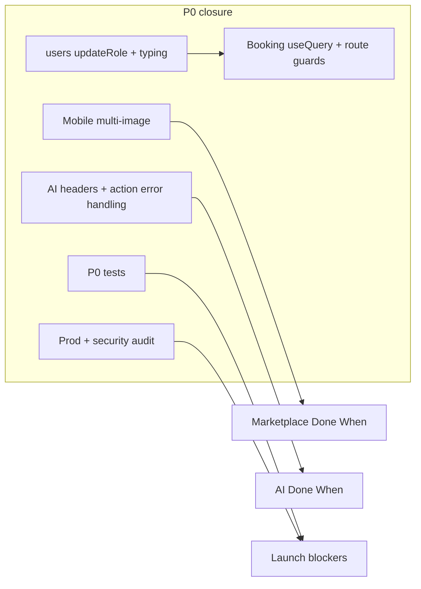

# What’s next to build (from EXECUTION_PLAN + SYSTEM_BLUEPRINT)

[SYSTEM_BLUEPRINT.MD](.cursor/SYSTEM_BLUEPRINT.MD) is a shorter strategy doc; several checkboxes there are **stale** (e.g. image storage and “Mark as Sold” are further along in the codebase than the blueprint suggests). Treat **[EXECUTION_PLAN.MD](.cursor/EXECUTION_PLAN.MD)** as the live backlog.

---

## Remaining P0 (do these before launch)

These are still `[ ]` or `[~]` under P0 / critical path / launch blockers:

| Area             | What’s left                                                                                                                                                                                                                                                                              |
| ---------------- | ---------------------------------------------------------------------------------------------------------------------------------------------------------------------------------------------------------------------------------------------------------------------------------------- |
| **Auth / RBAC**  | Public `**users:updateRole`** (or equivalent) — plan notes internal `[users.upsertUser](packages/backend/convex/users.ts)` exists but players cannot change role via app API; `[auth.ts](packages/backend/convex/auth.ts)` still uses `userId as any` for the P0 **strict typing** task. |
| **Marketplace**  | **Multi-image**: backend upload path is marked done; **mobile image picker** is the remaining slice to satisfy “multiple images + real-time UI.”                                                                                                                                         |
| **Integration**  | **Reactive booking status** via Convex `useQuery` on clients; **cross-system validation** (roles vs. which dashboard/routes are reachable).                                                                                                                                              |
| **AI bridge**    | Finish `[~]` items: **Python response headers / body alignment**, and **consistent try/catch + degradation** on all actions that call Python (plan calls out `predictItemPrice` / `evaluateFairness` still throwing on failure vs. `autoListWithAI`).                                    |
| **Quality gate** | P0 **tests**: double-booking, auth boundaries, E2E marketplace + booking flows.                                                                                                                                                                                                          |
| **Production**   | Env vars, Convex production, Python service deploy, **final mutation auth audit** (`ctx.auth.getUserIdentity()` everywhere).                                                                                                                                                             |

---

## P1 work that unblocks “Done When” lines (after or in parallel with stable schema)

Only after P0 policy is satisfied for launch; these close the plan’s incomplete acceptance criteria:

- **Marketplace**: categorical + price-range filtering, `[items:listByCategory](.cursor/EXECUTION_PLAN.MD)` with pagination, **index on category + price** (schema today has `[by_status_and_createdAt](packages/backend/convex/schema.ts)` but not the category/price index from the plan).
- **Mobile B2C**: **My Listings**, booking request modal, AI **live preview** hook + **fairness badges**.
- **Web B2B**: reservation management board, TanStack Table for bookings, `**getOwnerStats`** (plan dependency for analytics later).
- **Booking UX**: court availability **calendar** (distinct from existing `listAvailability` backend).
- **Misc backend**: `users:syncProfile`.

**Phase 2 gap from the plan**: **[P1] Court management mutations for owners** — still unchecked while bookings/courts schema and overlap logic exist.

---

## Blueprint alignment (30-day sprint doc)

[SYSTEM_BLUEPRINT.MD](.cursor/SYSTEM_BLUEPRINT.MD) **§3** should be refreshed when you next edit docs: mark image storage and sold-toggle as done where true, and keep “category + status indexes / search” tied to the execution plan’s **category + price index + listByCategory** work.

---

## Practical sequencing (1–3 tasks per session, per your plan rules)

1. **Close RBAC P0**: public role update + remove `as any` in `[auth.ts](packages/backend/convex/auth.ts)` — unblocks role redirects, route guards, and cross-system consistency tasks.
2. **Finish marketplace vertical slice**: mobile image picker + wire storage IDs to `<Image />` (integration task) so the marketplace “Done When” is honest.
3. **Booking vertical slice**: mobile booking modal + web management board + `useQuery` subscriptions so owner approve/cancel and player confirmation states are visible in real time.
4. **AI P0 polish**: align FastAPI + Convex actions, then add P0 tests and production checklist items.

No critical ambiguity: if you want to optimize for **fastest user-visible demo** vs **fastest launch checklist**, say which; the execution plan’s rule is **P0 first**, with **role API + mobile multi-image + booking UI** as the highest-leverage build order.